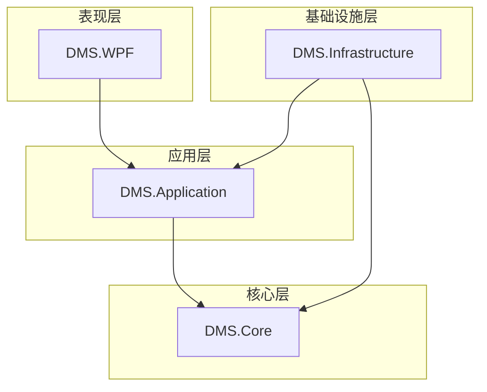

# 软件开发文档 - 设备管理系统 (DMS)

## 1. 引言

### 1.1. 项目概述

本文档旨在详细阐述设备管理系统（DMS）的设计与实现方案。该系统是一个用于管理、监控和数据采集的综合平台，核心功能包括：

*   **多协议设备支持**：能够管理和监控多种通信协议（如 Siemens S7、OPC UA、Modbus）的设备。
*   **层级化设备模型**：支持“设备 -> 变量表 -> 变量”的层级结构化管理。
*   **灵活的数据转发**：变量数据在采集后，可配置转发至一个或多个MQTT服务器。
*   **实时数据处理**：通过链式处理器对采集到的原始数据进行清洗、计算和转换。
*   **历史数据存储**：将处理后的数据存入数据库，用于历史追溯和分析。
*   **现代化的用户界面**：基于WPF框架，提供直观、响应迅速的操作界面。

### 1.2. 设计原则

*   **分层架构 (Layered Architecture)**：采用经典的洋葱架构思想，将项目分为`核心(Core)`、`应用(Application)`、`基础设施(Infrastructure)`和`表现(Presentation)`四层，实现高内聚、低耦合。
*   **依赖倒置原则 (DIP)**：高层模块不依赖于低层模块的具体实现，而是依赖于抽象（接口）。接口定义在核心层，具体实现在基础设施层。
*   **单一职责原则 (SRP)**：每个类和模块都只负责一项功能。
*   **可扩展性**：系统设计应易于扩展，例如，未来可以方便地增加新的通信协议或数据处理器。

## 2. 项目结构设计

系统将由以下四个主要项目组成，以实现关注点分离。

### 2.1. `DMS.Core` - 核心层

这是整个系统的核心，不依赖于任何外部框架或技术。

*   **职责**:
    *   定义核心的业务领域模型（Domain Models），如 `Device`, `VariableTable`, `Variable`, `MqttServer`。
    *   定义业务规则和逻辑。
    *   定义仓储库（Repositories）和领域服务的接口，如 `IDeviceRepository`, `IVariableRepository`。
*   **包含内容**:
    *   `Models/`: 存放领域模型类。
    *   `Enums/`: 存放核心业务相关的枚举。
    *   `Interfaces/`: 存放仓储库和领域服务的接口定义。
    *   `Exceptions/`: 存放自定义的业务异常。

### 2.2. `DMS.Application` - 应用层

负责编排和协调领域对象以完成具体的业务用例。

*   **职责**:
    *   实现具体的应用服务（Use Cases），如“添加新设备”、“更新变量值”。
    *   定义数据传输对象（DTOs），用于在表现层和应用层之间传递数据。
    *   处理事务和授权等应用级关注点。
*   **包含内容**:
    *   `Services/`: 存放应用服务的实现。
    *   `DTOs/`: 存放数据传输对象。
    *   `Interfaces/`: 存放应用服务的接口。

### 2.3. `DMS.Infrastructure` - 基础设施层

提供所有与外部世界交互的技术实现。

*   **职责**:
    *   实现 `DMS.Core` 中定义的仓储接口，负责与数据库进行交互（使用 `SqlSugar` ORM）。
    *   实现与其他外部系统的集成，如S7协议通信、MQTT客户端、日志记录（NLog）等。
    *   管理数据库连接、迁移和配置。
*   **包含内容**:
    *   `Data/`: 包含 `DbContext` 和数据库初始化逻辑。
    *   `Repositories/`: 仓储接口的具体实现。
    *   `Services/`: 存放与基础设施相关的服务实现（如S7通信服务、MQTT发布服务）。
    *   `Entities/`: 数据库表对应的实体类。

### 2.4. `DMS.WPF` - 表现层

用户界面（UI），负责与用户交互和数据显示。

*   **职责**:
    *   提供用户操作界面。
    *   显示来自应用层的数据。
    *   将用户的操作请求发送给应用层。
*   **包含内容**:
    *   `Views/`: XAML窗口和用户控件。
    *   `ViewModels/`: 视图模型（MVVM模式）。
    *   `Services/`: UI相关的服务，如导航、对话框和通知服务。
    *   `App.xaml.cs`: 程序启动和依赖注入（DI）容器的配置。

### 2.5. 项目依赖关系图

