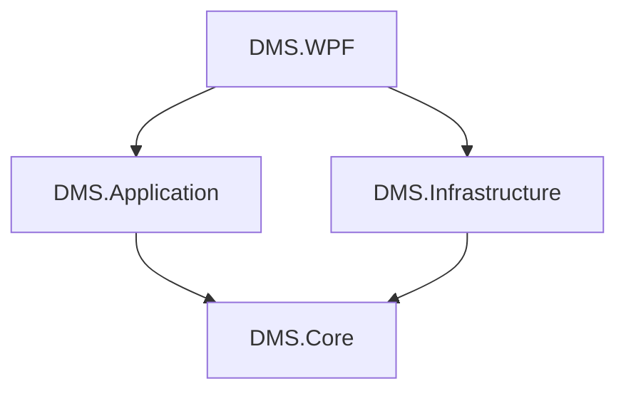

# 01. 项目总体设计与依赖

本文档定义了项目的最终分层架构、各项目职责以及每个项目所需的NuGet包依赖清单。

## 1. 项目分层架构

### 1.1. 设计思路与考量

*   **分层架构 (Layered Architecture)**：采用经典的洋葱架构（或称整洁架构）思想，将整个系统划分为 `Core` (核心)、`Application` (应用)、`Infrastructure` (基础设施) 和 `WPF` (表现) 四个逻辑层。
*   **依赖倒置原则 (Dependency Inversion Principle, DIP)**：高层模块（如 `Application`）不直接依赖低层模块（如 `Infrastructure`）的具体实现，而是依赖于抽象（接口）。这些抽象定义在 `Core` 层。

### 1.2. 设计优势

*   **高内聚、低耦合**：每个层级职责单一，内部功能紧密相关（高内聚），层与层之间通过接口而非具体实现进行交互，降低了相互依赖性（低耦合）。
*   **可维护性**：当某个技术实现（如数据库从SqlSugar切换到EF Core）发生变化时，只需修改 `Infrastructure` 层，对 `Application` 和 `Core` 层的影响最小。
*   **可测试性**：核心业务逻辑（`Core` 和 `Application`）不依赖外部技术，可以独立进行单元测试，无需启动数据库或外部服务，提高了测试效率和覆盖率。
*   **可扩展性**：易于引入新的功能模块或替换现有技术栈，例如，增加新的通信协议或更换UI框架。
*   **业务逻辑清晰**：核心业务规则集中在 `Core` 层，应用层负责业务流程的编排，使得业务逻辑一目了然。

### 1.3. 设计劣势/权衡

*   **初期复杂性**：相比于单体应用或简单的三层架构，分层架构在项目初期需要更多的设计投入和代码组织，增加了学习曲线。
*   **层间通信开销**：严格的分层可能导致数据在层间传递时需要进行多次对象转换（如领域模型 -> DTO -> 数据库实体），增加了少量运行时开销和代码量。
*   **过度设计风险**：对于非常简单的应用，过度分层可能引入不必要的复杂性，反而降低开发效率。

### 1.4. 各层职责

| 项目名               | 核心职责                                                                                             | 关键内容                                                                                               |
| ---------------------- | ---------------------------------------------------------------------------------------------------- | ------------------------------------------------------------------------------------------------------ |
| `DMS.Core`             | **领域核心**：定义业务规则和数据结构，不依赖任何具体技术实现。是整个系统的稳定内核。               | 领域模型 (`Device`), 业务枚举, 核心接口 (`IRepositoryManager`, `IDeviceRepository`)。            |
| `DMS.Application`      | **应用服务**：编排领域模型完成业务用例（Use Case），处理DTO转换。是UI层与核心层的桥梁。        | 应用服务 (`DeviceAppService`), 数据传输对象 (DTOs), AutoMapper配置。                       |
| `DMS.Infrastructure`   | **基础设施**：提供所有外部技术的具体实现，如数据库访问、协议通信、日志记录等。负责实现核心层的接口。 | 数据库实体, `RepositoryManager`实现, S7/MQTT通信服务, NLog日志Target。                |
| `DMS.WPF`              | **表现层**：提供用户界面（UI），采用MVVM模式。负责用户交互、数据显示和请求派发。                     | 视图 (Views), 视图模型 (ViewModels), 核心UI服务 (`IChannelBus`, `INavigationService`)。            |

### 1.5. 依赖关系图

## 2. NuGet包依赖清单

### 2.1. 设计思路与考量

*   **按需引入**：每个项目只引入其职责范围内必需的NuGet包，避免不必要的依赖膨胀。
*   **版本管理**：建议使用 `Directory.Packages.props` 或 `PackageReference` 统一管理所有项目的NuGet包版本，确保一致性。
*   **稳定性优先**：优先选择成熟、稳定且社区活跃的库。

### 2.2. 设计优势

*   **项目职责清晰**：通过依赖的NuGet包可以直观地看出该项目的职责和技术栈。
*   **减少冲突**：避免不同项目引入相同库的不同版本导致的冲突。
*   **优化构建速度**：减少不必要的引用可以略微加快项目构建速度。

### 2.3. 设计劣势/权衡

*   **管理开销**：需要手动为每个项目添加引用，并确保版本一致性（尽管有工具可以辅助）。
*   **学习成本**：对于不熟悉特定库的开发者，需要额外学习其用法。

### 2.4. 各项目依赖

### `DMS.Core`
*   **设计思路**：作为核心业务逻辑层，应保持技术中立和纯净，不依赖任何外部框架或第三方库。
*   **优势**：最大化可移植性和可测试性，确保业务规则的稳定性，不受外部技术变化的影响。
*   **劣势**：如果某些通用工具类（如简单的辅助函数）被多个层使用，可能需要在 `Core` 层手动实现或复制，而不是直接引用一个通用库。
*   **依赖**：无任何第三方依赖。

### `DMS.Application`
*   **设计思路**：负责业务流程编排和数据转换，需要对象映射工具。
*   **优势**：`AutoMapper` 简化了DTO与领域模型之间的转换，减少了大量重复的映射代码。
*   **劣势**：引入了额外的映射配置，对于简单的映射可能显得有些重，且需要一定的学习成本。
*   **依赖**：
    *   `AutoMapper`
    *   `AutoMapper.Extensions.Microsoft.DependencyInjection`

### `DMS.Infrastructure`
*   **设计思路**：作为技术实现层，需要与数据库、PLC、MQTT等外部系统交互，因此需要引入相应的技术栈库。
*   **优势**：利用成熟的第三方库（如 `SqlSugar`, `S7netplus`, `MQTTnet`）可以大大加速开发，并利用其经过验证的稳定性、性能和功能。
*   **劣势**：对特定库的依赖性强，未来替换成本较高；需要关注库的更新和兼容性问题。
*   **依赖**：
    *   `SqlSugarCore`
    *   `S7netplus`
    *   `MQTTnet`
    *   `MQTTnet.Extensions.ManagedClient`
    *   `NLog.Extensions.Logging`

### `DMS.WPF`
*   **设计思路**：作为表现层，需要UI框架、MVVM支持、依赖注入和日志集成。
*   **优势**：`iNKORE.UI.WPF.Modern` 提供现代化的UI组件；`CommunityToolkit.Mvvm` 简化MVVM开发；`Microsoft.Extensions.DependencyInjection` 提供标准的DI容器。
*   **劣势**：引入了UI框架和MVVM库的学习成本；UI框架可能存在一定的定制限制。
*   **依赖**：
    *   `Microsoft.Extensions.DependencyInjection`
    *   `Microsoft.Extensions.Hosting` (用于 `IHostedService`)
    *   `CommunityToolkit.Mvvm`
    *   `iNKORE.UI.WPF.Modern`
    *   `NLog.Extensions.Logging`