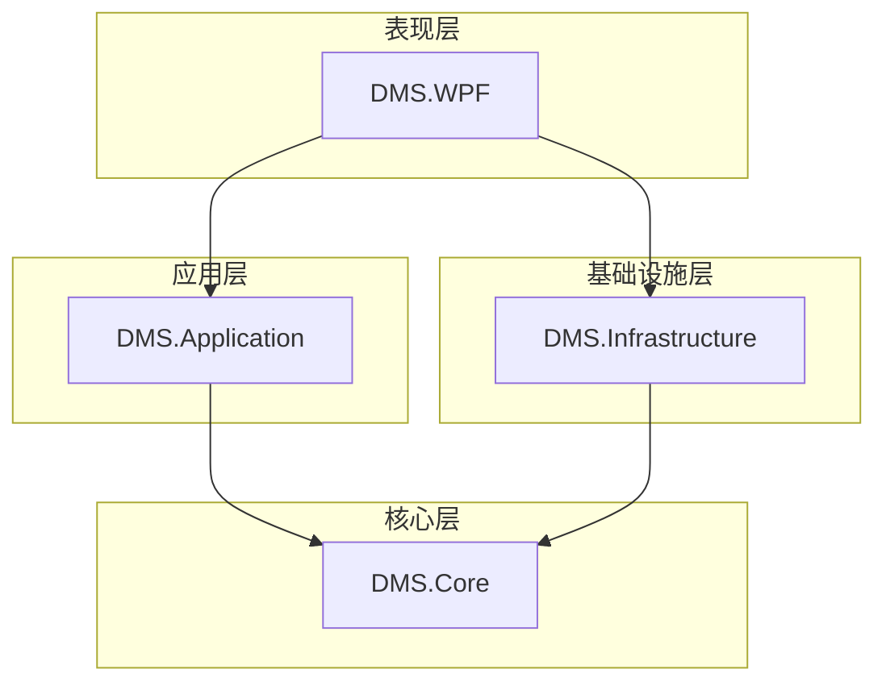

# 软件开发文档 - 总体架构与依赖

本文档详细阐述了设备管理系统（DMS）的总体设计、分层架构、各层职责以及每个项目所需的NuGet包依赖。

## 1. 项目概述

DMS系统是一个用于管理、监控和数据采集的综合平台，核心功能包括：

*   **多协议设备支持**：能够管理和监控多种通信协议（如 Siemens S7、OPC UA、Modbus）的设备。
*   **层级化设备模型**：支持“设备 -> 变量表 -> 变量”的层级结构化管理。
*   **灵活的数据转发**：变量数据在采集后，可配置转发至一个或多个MQTT服务器。
*   **实时数据处理**：通过链式处理器对采集到的原始数据进行清洗、计算和转换。
*   **历史数据存储**：将处理后的数据存入数据库，用于历史追溯和分析。
*   **现代化的用户界面**：基于WPF框架，提供直观、响应迅速的操作界面。

## 2. 设计原则

*   **分层架构 (Layered Architecture)**：采用经典的洋葱架构思想，将项目分为`核心(Core)`、`应用(Application)`、`基础设施(Infrastructure)`和`表现(Presentation)`四层，实现高内聚、低耦合。
*   **依赖倒置原则 (DIP)**：高层模块不依赖于低层模块的具体实现，而是依赖于抽象（接口）。接口定义在核心层，具体实现在基础设施层。
*   **单一职责原则 (SRP)**：每个类和模块都只负责一项功能。
*   **可扩展性**：系统设计应易于扩展，例如，未来可以方便地增加新的通信协议或数据处理器。

## 3. 项目结构与职责

系统将由以下四个主要项目组成，以实现关注点分离。

| 项目名               | 核心职责                                                                                             | 关键内容                                                                                               |
| ---------------------- | ---------------------------------------------------------------------------------------------------- | ------------------------------------------------------------------------------------------------------ |
| `DMS.Core`             | **领域核心**：定义业务规则和数据结构，不依赖任何具体技术实现。是整个系统的稳定内核。               | 领域模型 (`Device`, `Variable`)、业务枚举、仓储接口 (`IDeviceRepository`)、自定义业务异常。            |
| `DMS.Application`      | **应用服务**：编排领域模型完成业务用例（Use Case），处理事务、DTO转换。是UI层与核心层的桥梁。        | 应用服务 (`DeviceAppService`)、数据传输对象 (DTOs)、应用层接口、AutoMapper配置。                       |
| `DMS.Infrastructure`   | **基础设施**：提供所有外部技术的具体实现，如数据库访问、协议通信、日志记录等。负责实现核心层的接口。 | 数据库实体、SqlSugar仓储实现、S7/MQTT通信服务、NLog日志服务、数据处理链的具体处理器。                |
| `DMS.WPF`              | **表现层**：提供用户界面（UI），采用MVVM模式。负责用户交互、数据显示和请求派发。                     | 视图 (Views)、视图模型 (ViewModels)、UI服务（导航、对话框）、依赖注入容器配置、程序入口。            |

### 项目依赖关系图



## 4. NuGet包依赖清单

以下是每个项目必须安装的NuGet包，请严格按照此清单进行安装。

### 4.1. `DMS.Core`

此项目应保持纯净，**不安装任何第三方NuGet包**，以确保其独立性。

### 4.2. `DMS.Application`

| 包名                                | 用途                                                                 |
| ----------------------------------- | -------------------------------------------------------------------- |
| `AutoMapper`                        | 用于在领域模型和DTO之间进行自动对象映射。                              |
| `AutoMapper.Extensions.Microsoft.DependencyInjection` | 将AutoMapper与依赖注入容器集成。                                     |

### 4.3. `DMS.Infrastructure`

| 包名                                | 用途                                                                 |
| ----------------------------------- | -------------------------------------------------------------------- |
| `SqlSugarCore`                      | 强大的ORM框架，用于数据库操作。                                      |
| `S7netplus`                         | 用于与Siemens S7系列PLC进行通信。                                    |
| `MQTTnet`                           | 高性能的.NET MQTT客户端库，用于数据发布。                              |
| `MQTTnet.Extensions.ManagedClient`  | 提供了更稳定的托管MQTT客户端，支持自动重连。                         |
| `NLog`                              | 灵活的日志记录框架。                                                 |
| `NLog.Extensions.Logging`           | 将NLog与Microsoft的通用日志抽象集成。                                |
| `Microsoft.Extensions.Caching.Memory` | 提供内存缓存功能，用于实现变量值变化检测。                           |

### 4.4. `DMS.WPF`

| 包名                                      | 用途                                                                 |
| ----------------------------------------- | -------------------------------------------------------------------- |
| `Microsoft.Extensions.DependencyInjection` | 官方依赖注入框架，用于管理整个应用的生命周期和依赖关系。             |
| `Microsoft.Extensions.Hosting`            | 用于 `IHostedService`，支持后台服务。                                |
| `CommunityToolkit.Mvvm`                   | 官方MVVM工具包，提供`ObservableObject`, `RelayCommand`等，极大简化MVVM开发。 |
| `iNKORE.UI.WPF.Modern`                    | 一套美观且功能强大的WPF UI控件库，用于构建现代化界面（如对话框、通知）。 |
| `NLog.Extensions.Logging`                 | 用于在WPF项目中配置和使用NLog。                                      |
| `Microsoft.Xaml.Behaviors.Wpf`            | 提供事件到命令的绑定等行为支持，是MVVM的有力补充。                   |

## 5. 开发环境初始化命令示例

您可以使用 `dotnet` CLI 快速创建项目并添加包：

```bash
# 创建解决方案和项目
dotnet new sln -n DMS
dotnet new classlib -n DMS.Core
dotnet new classlib -n DMS.Application
dotnet new classlib -n DMS.Infrastructure
dotnet new wpf -n DMS.WPF

# 将项目添加到解决方案
dotnet sln add ./**/*.csproj

# 为DMS.Application添加包
dotnet add DMS.Application package AutoMapper
# ...其他包

# 添加项目引用
dotnet add DMS.Application reference DMS.Core
dotnet add DMS.Infrastructure reference DMS.Application
dotnet add DMS.WPF reference DMS.Infrastructure
```
