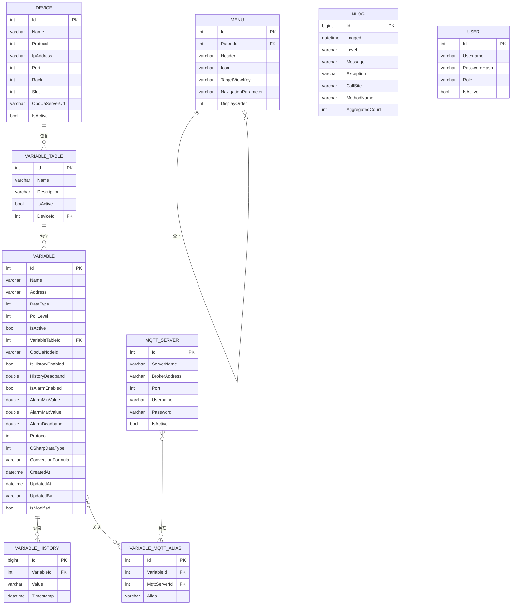

# 软件开发文档 - DMS.Infrastructure - 数据访问与服务

本文档详细阐述了 `DMS.Infrastructure` 层的设计，它是所有外部技术和服务的具体实现地。它实现了 `DMS.Core` 定义的接口，为 `DMS.Application` 层提供数据和功能支持，并负责数据持久化、事务管理以及与外部世界的通信。

## 1. 目录结构

```
DMS.Infrastructure/
├── Data/
│   ├── SqlSugarDbContext.cs
│   └── RepositoryManager.cs
├── Entities/
│   ├── DbDevice.cs
│   ├── DbMqttServer.cs
│   ├── DbVariable.cs
│   ├── DbVariableTable.cs
│   ├── DbVariableHistory.cs
│   ├── DbVariableMqttAlias.cs
│   ├── DbMenu.cs
│   ├── DbNlog.cs
│   └── DbUser.cs
├── Repositories/
│   ├── BaseRepository.cs
│   ├── DeviceRepository.cs
│   ├── MqttServerRepository.cs
│   ├── VariableRepository.cs
│   ├── VariableTableRepository.cs
│   ├── VariableHistoryRepository.cs
│   ├── VariableMqttAliasRepository.cs
│   ├── MenuRepository.cs
│   └── UserRepository.cs
├── Services/
│   ├── Communication/
│   │   ├── S7DeviceAgent.cs
│   │   └── MqttPublishService.cs
│   ├── Processing/
│   │   ├── ChangeDetectionProcessor.cs
│   │   ├── HistoryStorageProcessor.cs
│   │   └── MqttPublishProcessor.cs
│   ├── S7BackgroundService.cs
│   ├── DataProcessingService.cs
│   ├── DatabaseInitializerService.cs
│   └── MenuService.cs
├── Logging/
│   ├── ThrottlingDatabaseTarget.cs
│   └── NLogService.cs
├── Profiles/
│   └── MappingProfile.cs
└── DMS.Infrastructure.csproj
```

## 2. 数据库设计与实体 (`Entities/`)

本文档详细描述了DMS系统的数据库结构，包括表、字段和关系。数据库实体类与数据库表一一对应，使用了 `SqlSugar` 的特性（Attribute）来定义主键、外键等。

### 2.1. 数据库关系图 (ERD)



### 2.2. 数据库实体类示例

#### `DbDevice.cs`

```csharp
// 文件: DMS.Infrastructure/Entities/DbDevice.cs
using SqlSugar;

namespace DMS.Infrastructure.Entities;

[SugarTable("Devices")]
public class DbDevice
{
    [SugarColumn(IsPrimaryKey = true, IsIdentity = true)]
    public int Id { get; set; }
    public string Name { get; set; }
    public int Protocol { get; set; } // 对应 ProtocolType 枚举
    public string IpAddress { get; set; }
    public int Port { get; set; }
    public int Rack { get; set; }
    public int Slot { get; set; }
    public string OpcUaServerUrl { get; set; }
    public bool IsActive { get; set; }
}
```

#### `DbVariableTable.cs`

```csharp
// 文件: DMS.Infrastructure/Entities/DbVariableTable.cs
using SqlSugar;

namespace DMS.Infrastructure.Entities;

[SugarTable("VariableTables")]
public class DbVariableTable
{
    [SugarColumn(IsPrimaryKey = true, IsIdentity = true)]
    public int Id { get; set; }
    public string Name { get; set; }
    public string Description { get; set; }
    public bool IsActive { get; set; }
    public int DeviceId { get; set; }
    public int Protocol { get; set; } // 对应 ProtocolType 枚举
}
```

#### `DbVariable.cs`

```csharp
// 文件: DMS.Infrastructure/Entities/DbVariable.cs
using SqlSugar;

namespace DMS.Infrastructure.Entities;

[SugarTable("Variables")]
public class DbVariable
{
    [SugarColumn(IsPrimaryKey = true, IsIdentity = true)]
    public int Id { get; set; }
    public string Name { get; set; }
    public string Address { get; set; }
    public int DataType { get; set; } // 对应 SignalType 枚举
    public int PollLevel { get; set; } // 对应 PollLevelType 枚举
    public bool IsActive { get; set; }
    public int VariableTableId { get; set; }
    public string OpcUaNodeId { get; set; }
    public bool IsHistoryEnabled { get; set; }
    public double HistoryDeadband { get; set; }
    public bool IsAlarmEnabled { get; set; }
    public double AlarmMinValue { get; set; }
    public double AlarmMaxValue { get; set; }
    public double AlarmDeadband { get; set; }
    public int Protocol { get; set; } // 对应 ProtocolType 枚举
    public int CSharpDataType { get; set; } // 对应 CSharpDataType 枚举
    public string ConversionFormula { get; set; }
    public DateTime CreatedAt { get; set; }
    public DateTime UpdatedAt { get; set; }
    public string UpdatedBy { get; set; }
    public bool IsModified { get; set; }
}
```

#### `DbMqttServer.cs`

```csharp
// 文件: DMS.Infrastructure/Entities/DbMqttServer.cs
using SqlSugar;

namespace DMS.Infrastructure.Entities;

[SugarTable("MqttServers")]
public class DbMqttServer
{
    [SugarColumn(IsPrimaryKey = true, IsIdentity = true)]
    public int Id { get; set; }
    public string ServerName { get; set; }
    public string BrokerAddress { get; set; }
    public int Port { get; set; }
    public string Username { get; set; }
    public string Password { get; set; }
    public bool IsActive { get; set; }
    public string SubscribeTopic { get; set; }
    public string PublishTopic { get; set; }
    public string ClientId { get; set; }
    public DateTime CreatedAt { get; set; }
    public DateTime? ConnectedAt { get; set; }
    public long ConnectionDuration { get; set; }
    public string MessageFormat { get; set; }
}
```

#### `DbVariableHistory.cs`

```csharp
// 文件: DMS.Infrastructure/Entities/DbVariableHistory.cs
using SqlSugar;

namespace DMS.Infrastructure.Entities;

[SugarTable("VariableHistories")]
public class DbVariableHistory
{
    [SugarColumn(IsPrimaryKey = true, IsIdentity = true)]
    public long Id { get; set; }
    public int VariableId { get; set; }
    public string Value { get; set; }
    public DateTime Timestamp { get; set; }
}
```

#### `DbVariableMqttAlias.cs`

```csharp
// 文件: DMS.Infrastructure/Entities/DbVariableMqttAlias.cs
using SqlSugar;

namespace DMS.Infrastructure.Entities;

/// <summary>
/// 数据库实体：对应数据库中的 VariableMqttAliases 表。
/// </summary>
[SugarTable("VariableMqttAliases")]
public class DbVariableMqttAlias
{
    [SugarColumn(IsPrimaryKey = true, IsIdentity = true)]
    public int Id { get; set; }

    /// <summary>
    /// 外键，指向 Variables 表的 Id。
    /// </summary>
    public int VariableId { get; set; }

    /// <summary>
    /// 外键，指向 MqttServers 表的 Id。
    /// </summary>
    public int MqttServerId { get; set; }

    /// <summary>
    /// 针对此特定[变量-服务器]连接的发布别名。
    /// </summary>
    public string Alias { get; set; }
}
```

#### `DbMenu.cs`

```csharp
// 文件: DMS.Infrastructure/Entities/DbMenu.cs
using SqlSugar;

namespace DMS.Infrastructure.Entities;

[SugarTable("Menus")]
public class DbMenu
{
    [SugarColumn(IsPrimaryKey = true, IsIdentity = true)]
    public int Id { get; set; }

    [SugarColumn(IsNullable = true)]
    public int? ParentId { get; set; }

    public string Header { get; set; }

    public string Icon { get; set; }

    public string TargetViewKey { get; set; }

    [SugarColumn(IsNullable = true)]
    public string NavigationParameter { get; set; }

    public int DisplayOrder { get; set; }
}
```

#### `DbNlog.cs`

```csharp
// 文件: DMS.Infrastructure/Entities/DbNlog.cs
using SqlSugar;
using System;

namespace DMS.Infrastructure.Entities;

/// <summary>
/// 数据库实体：对应数据库中的 Logs 表，用于存储应用程序日志。
/// </summary>
[SugarTable("Logs")]
public class DbNlog
{
    [SugarColumn(IsPrimaryKey = true, IsIdentity = true)]
    public long Id { get; set; }

    /// <summary>
    /// 日志记录的时间戳。
    /// </summary>
    public DateTime Logged { get; set; }

    /// <summary>
    /// 日志级别 (e.g., "Info", "Warn", "Error", "Debug")。
    /// </summary>
    public string Level { get; set; }

    /// <summary>
    /// 日志消息主体。
    /// </summary>
    [SugarColumn(Length = -1)] // 映射为NVARCHAR(MAX)或类似类型
    public string Message { get; set; }

    /// <summary>
    /// 异常信息，包括堆栈跟踪。如果无异常则为null。
    /// </summary>
    [SugarColumn(IsNullable = true, Length = -1)]
    public string Exception { get; set; }

    /// <summary>
    /// 记录日志的调用点信息 (文件路径:行号)。
    /// </summary>
    public string CallSite { get; set; }

    /// <summary>
    /// 记录日志的方法名。
    /// </summary>
    public string MethodName { get; set; }

    /// <summary>
    /// (用于聚合) 此条日志在指定时间窗口内被触发的总次数。默认为1。
    /// </summary>
    public int AggregatedCount { get; set; } = 1;
}
```

#### `DbUser.cs`

```csharp
// 文件: DMS.Infrastructure/Entities/DbUser.cs
using SqlSugar;

namespace DMS.Infrastructure.Entities;

[SugarTable("Users")]
public class DbUser
{
    [SugarColumn(IsPrimaryKey = true, IsIdentity = true)]
    public int Id { get; set; }
    public string Username { get; set; }
    public string PasswordHash { get; set; }
    public string Role { get; set; }
    public bool IsActive { get; set; }
}
```

## 3. 事务管理 (`RepositoryManager`)

`RepositoryManager` 是工作单元（Unit of Work, UoW）模式的具体实现。它作为所有仓储的统一入口，并管理数据库事务，确保所有通过它获取的仓储实例都共享同一个 `ISqlSugarClient` 实例，从而确保它们在同一个数据库会话和事务中操作。

### 3.1. 设计思路与考量

*   **模式**：`RepositoryManager` 是工作单元（Unit of Work, UoW）模式的具体实现。它作为所有仓储的统一入口，并管理数据库事务。
*   **共享上下文**：所有通过 `RepositoryManager` 获取的仓储实例都共享同一个 `ISqlSugarClient` 实例，从而确保它们在同一个数据库会话和事务中操作。
*   **生命周期**：`RepositoryManager` 通常被注册为 `Scoped` 或 `Transient` 生命周期，确保每个业务操作都有一个独立的工作单元。

### 3.2. 设计优势

*   **原子性**：确保跨多个仓储的操作（如创建设备、变量表和菜单）要么全部成功，要么全部失败，维护数据一致性。
*   **简化事务管理**：应用层无需直接与数据库事务API交互，只需调用 `BeginTransaction()`, `CommitAsync()`, `RollbackAsync()`。
*   **解耦**：应用层不直接依赖具体的仓储实现，而是依赖于 `IRepositoryManager` 这一抽象。
*   **资源优化**：在单个业务操作中，所有仓储共享同一个数据库连接，减少了连接开销。

### 3.3. 设计劣势/权衡

*   **复杂性增加**：相比于直接使用仓储，引入UoW模式增加了额外的抽象层和概念。
*   **仓储依赖**：`IRepositoryManager` 接口需要列出所有它管理的仓储，当新增仓储时，需要修改此接口。
*   **懒加载**：为了避免在 `RepositoryManager` 构造时就创建所有仓储实例的开销，通常会使用懒加载（`Lazy<T>`），这增加了少量复杂性。

### 3.4. 示例：`RepositoryManager.cs`

```csharp
// 文件: DMS.Infrastructure/Data/RepositoryManager.cs
using DMS.Core.Interfaces;
using SqlSugar;
using System;

namespace DMS.Infrastructure.Data;

/// <summary>
/// IRepositoryManager 的 SqlSugar 实现，管理所有仓储实例和数据库事务。
/// </summary>
public class RepositoryManager : IRepositoryManager
{
    private readonly ISqlSugarClient _db;
    private readonly Lazy<IDeviceRepository> _lazyDevices;
    private readonly Lazy<IVariableTableRepository> _lazyVariableTables;
    private readonly Lazy<IVariableRepository> _lazyVariables;
    private readonly Lazy<IMqttServerRepository> _lazyMqttServers;
    private readonly Lazy<IVariableMqttAliasRepository> _lazyVariableMqttAliases;
    private readonly Lazy<IMenuRepository> _lazyMenus;
    private readonly Lazy<IVariableHistoryRepository> _lazyVariableHistories;
    private readonly Lazy<IUserRepository> _lazyUsers;

    /// <summary>
    /// 构造函数，通过依赖注入获取 SqlSugar 客户端实例。
    /// </summary>
    public RepositoryManager(ISqlSugarClient db, IMapper mapper) // 添加 IMapper 依赖
    {
        _db = db;
        // 使用 Lazy<T> 实现仓储的懒加载，确保它们在第一次被访问时才创建。
        // 所有仓储都共享同一个 _db 实例，以保证事务的一致性。
        _lazyDevices = new Lazy<IDeviceRepository>(() => new DeviceRepository(_db, mapper));
        _lazyVariableTables = new Lazy<IVariableTableRepository>(() => new VariableTableRepository(_db, mapper));
        _lazyVariables = new Lazy<IVariableRepository>(() => new VariableRepository(_db, mapper));
        _lazyMqttServers = new Lazy<IMqttServerRepository>(() => new MqttServerRepository(_db, mapper));
        _lazyVariableMqttAliases = new Lazy<IVariableMqttAliasRepository>(() => new VariableMqttAliasRepository(_db, mapper));
        _lazyMenus = new Lazy<IMenuRepository>(() => new MenuRepository(_db, mapper));
        _lazyVariableHistories = new Lazy<IVariableHistoryRepository>(() => new VariableHistoryRepository(_db, mapper));
        _lazyUsers = new Lazy<IUserRepository>(() => new UserRepository(_db, mapper));
    }

    public IDeviceRepository Devices => _lazyDevices.Value;
    public IVariableTableRepository VariableTables => _lazyVariableTables.Value;
    public IVariableRepository Variables => _lazyVariables.Value;
    public IMqttServerRepository MqttServers => _lazyMqttServers.Value;
    public IVariableMqttAliasRepository VariableMqttAliases => _lazyVariableMqttAliases.Value;
    public IMenuRepository Menus => _lazyMenus.Value;
    public IVariableHistoryRepository VariableHistories => _lazyVariableHistories.Value;
    public IUserRepository Users => _lazyUsers.Value;

    /// <summary>
    /// 开始一个新的数据库事务。
    /// </summary>
    public void BeginTransaction()
    {
        _db.BeginTran();
    }

    /// <summary>
    /// 异步提交当前事务中的所有变更。
    /// </summary>
    public async Task CommitAsync()
    {
        await _db.CommitTranAsync();
    }

    /// <summary>
    /// 异步回滚当前事务中的所有变更。
    /// </summary>
    public async Task RollbackAsync()
    {
        await _db.RollbackTranAsync();
    }

    /// <summary>
    /// 释放 SqlSugar 客户端资源。通常由 DI 容器管理。
    /// </summary>
    public void Dispose()
    {
        _db.Dispose();
    }
}
```

## 4. 仓储实现 (`Repositories/`)

仓储（Repository）是数据访问层的一部分，负责实现 `DMS.Core` 中定义的仓储接口。它们使用ORM框架（如SqlSugar）与数据库进行实际交互，将数据库实体转换为领域模型，反之亦然。

### 4.1. 设计思路与考量

*   **职责**：仓储（Repository）是数据访问层的一部分，负责实现 `DMS.Core` 中定义的仓储接口。它们使用ORM框架（如SqlSugar）与数据库进行实际交互，将数据库实体转换为领域模型，反之亦然。
*   **通用性**：可以有一个 `BaseRepository` 来实现通用的CRUD操作，减少重复代码。
*   **特定查询**：为每个仓储接口实现其特有的查询方法（如 `GetActiveDevicesWithDetailsAsync`）。

### 4.2. 设计优势

*   **实现细节封装**：将ORM框架和数据库查询的细节封装在仓储内部，上层无需关心。
*   **可替换性**：如果需要更换ORM框架或数据库类型，只需修改仓储实现，而无需修改应用层或核心层。
*   **性能优化点**：可以在仓储层进行查询优化（如使用 `Include` 或 `Join` 预加载关联数据）。

### 4.3. 设计劣势/权衡

*   **代码量**：即使有 `BaseRepository`，每个仓储仍然需要一些样板代码。
*   **复杂查询**：对于非常复杂的、跨多个聚合根的查询，有时仓储模式会显得笨拙，可能需要引入查询对象（Query Object）模式。

### 4.4. 示例：`BaseRepository.cs`

```csharp
// 文件: DMS.Infrastructure/Repositories/BaseRepository.cs
using AutoMapper;
using DMS.Core.Interfaces;
using SqlSugar;
using System.Collections.Generic;
using System.Threading.Tasks;

namespace DMS.Infrastructure.Repositories;

/// <summary>
/// 仓储基类，实现了 IBaseRepository 接口的通用 CRUD 操作。
/// </summary>
/// <typeparam name="TDomain">领域模型类型。</typeparam>
/// <typeparam name="TDbEntity">数据库实体类型。</typeparam>
public abstract class BaseRepository<TDomain, TDbEntity> : IBaseRepository<TDomain>
    where TDomain : class
    where TDbEntity : class, new()
{
    protected readonly ISqlSugarClient _db;
    protected readonly IMapper _mapper;

    public BaseRepository(ISqlSugarClient db, IMapper mapper)
    {
        _db = db;
        _mapper = mapper;
    }

    public virtual async Task AddAsync(TDomain entity)
    {
        var dbEntity = _mapper.Map<TDbEntity>(entity);
        await _db.Insertable(dbEntity).ExecuteCommandAsync();
        // 映射回ID，如果实体是自增ID
        _mapper.Map(dbEntity, entity);
    }

    public virtual async Task DeleteAsync(int id)
    {
        await _db.Deleteable<TDbEntity>(id).ExecuteCommandAsync();
    }

    public virtual async Task<List<TDomain>> GetAllAsync()
    {
        var dbEntities = await _db.Queryable<TDbEntity>().ToListAsync();
        return _mapper.Map<List<TDomain>>(dbEntities);
    }

    public virtual async Task<TDomain> GetByIdAsync(int id)
    {
        var dbEntity = await _db.Queryable<TDbEntity>().InSingleAsync(id);
        return _mapper.Map<TDomain>(dbEntity);
    }

    public virtual async Task UpdateAsync(TDomain entity)
    {
        var dbEntity = _mapper.Map<TDbEntity>(entity);
        await _db.Updateable(dbEntity).ExecuteCommandAsync();
    }
}
```

### 4.5. 示例：`DeviceRepository.cs`

```csharp
// 文件: DMS.Infrastructure/Repositories/DeviceRepository.cs
using AutoMapper;
using DMS.Core.Interfaces;
using DMS.Core.Models;
using DMS.Infrastructure.Entities;
using SqlSugar;
using System.Collections.Generic;
using System.Linq;
using System.Threading.Tasks;

namespace DMS.Infrastructure.Repositories;

/// <summary>
/// 设备仓储的具体实现。
/// </summary>
public class DeviceRepository : BaseRepository<Device, DbDevice>, IDeviceRepository
{
    public DeviceRepository(ISqlSugarClient db, IMapper mapper) : base(db, mapper) { }

    /// <summary>
    /// 异步获取所有激活的S7设备，并级联加载其下的变量表和变量。
    /// </summary>
    public async Task<List<Device>> GetActiveDevicesWithDetailsAsync(ProtocolType protocol)
    {
        var dbDevices = await _db.Queryable<DbDevice>()
                                 .Where(d => d.IsActive && d.Protocol == (int)protocol)
                                 .Mapper(d => d.VariableTables, d => d.Id, d => d.VariableTables.Select(vt => vt.DeviceId).ToList())
                                 .Mapper(d => d.VariableTables.Select(vt => vt.Variables), vt => vt.Id, vt => vt.Variables.Select(v => v.VariableTableId).ToList())
                                 .ToListAsync();
        return _mapper.Map<List<Device>>(dbDevices);
    }

    /// <summary>
    /// 异步根据设备ID获取设备及其所有详细信息（变量表、变量、MQTT别名等）。
    /// </summary>
    public async Task<Device> GetDeviceWithDetailsAsync(int deviceId)
    {
        var dbDevice = await _db.Queryable<DbDevice>()
                                .Where(d => d.Id == deviceId)
                                .Mapper(d => d.VariableTables, d => d.Id, d => d.VariableTables.Select(vt => vt.DeviceId).ToList())
                                .Mapper(d => d.VariableTables.Select(vt => vt.Variables), vt => vt.Id, vt => vt.Variables.Select(v => v.VariableTableId).ToList())
                                .FirstAsync();

        if (dbDevice == null) return null;

        // 手动加载 VariableMqttAlias，因为 SqlSugar 的 Mapper 可能无法直接处理多层嵌套的关联实体
        foreach (var variableTable in dbDevice.VariableTables)
        {
            foreach (var variable in variableTable.Variables)
            {
                var dbAliases = await _db.Queryable<DbVariableMqttAlias>()
                                         .Where(a => a.VariableId == variable.Id)
                                         .Mapper(a => a.MqttServer, a => a.MqttServerId)
                                         .ToListAsync();
                variable.MqttAliases = _mapper.Map<List<VariableMqttAlias>>(dbAliases);
            }
        }

        return _mapper.Map<Device>(dbDevice);
    }
}
```

## 5. 外部服务 (`Services/`)

### 5.1. S7通信架构 (“编排者-代理”模式)

采用“编排者-代理”（Orchestrator-Agent）模式。`S7BackgroundService` 作为编排者，负责管理所有S7设备的生命周期；每个 `S7DeviceAgent` 作为代理，专门负责与**一个**S7 PLC进行所有交互。

#### 5.1.1. 设计思路与考量

*   **模式**：采用“编排者-代理”（Orchestrator-Agent）模式。`S7BackgroundService` 作为编排者，负责管理所有S7设备的生命周期；每个 `S7DeviceAgent` 作为代理，专门负责与**一个**S7 PLC进行所有交互。
*   **职责分离**：将设备管理（启动、停止、配置更新）与具体设备通信（连接、轮询、读写）的职责分离。
*   **并发性**：每个 `S7DeviceAgent` 独立运行，可以并行处理多个设备的通信，提高系统吞吐量。
*   **热重载**：通过消息机制，允许在运行时动态更新设备的变量配置，而无需重启整个服务。

#### 5.1.2. 设计优势

*   **高可靠性**：单个设备的通信故障不会影响其他设备的正常运行。
*   **可扩展性**：易于添加新的设备类型或通信协议，只需实现新的 `DeviceAgent`。
*   **动态配置**：支持运行时修改设备和变量配置，提高了系统的灵活性和可用性。
*   **资源隔离**：每个Agent管理自己的连接和资源，避免资源争用。

#### 5.1.3. 设计劣势/权衡

*   **复杂性增加**：引入了Agent的概念和Agent与Orchestrator之间的通信机制，增加了初期设计和实现复杂性。
*   **资源消耗**：每个Agent可能需要维护独立的连接和线程，当设备数量非常庞大时，可能会增加资源消耗。

#### 5.1.4. `S7BackgroundService.cs` (编排者)

作为 `IHostedService` 运行，负责从数据库加载激活的S7设备，并为每个设备创建和管理 `S7DeviceAgent` 实例。它还监听配置变更消息，以触发Agent的热重载。

```csharp
// 文件: DMS.Infrastructure/Services/S7BackgroundService.cs
using Microsoft.Extensions.Hosting;
using DMS.Core.Interfaces;
using DMS.WPF.Services;
using CommunityToolkit.Mvvm.Messaging;
using System.Collections.Concurrent;
using System.Threading;
using System.Threading.Tasks;
using DMS.Core.Enums;
using DMS.WPF.Messages;

namespace DMS.Infrastructure.Services;

/// <summary>
/// S7后台服务编排者，作为IHostedService运行，管理所有S7设备的通信代理。
/// </summary>
public class S7BackgroundService : IHostedService
{
    private readonly IRepositoryManager _repoManager;
    private readonly IChannelBus _channelBus;
    private readonly IMessenger _messenger;
    private readonly ConcurrentDictionary<int, S7DeviceAgent> _activeAgents = new();

    /// <summary>
    /// 构造函数，通过依赖注入获取所需服务。
    /// </summary>
    public S7BackgroundService(IRepositoryManager repo, IChannelBus bus, IMessenger msg)
    {
        _repoManager = repo;
        _channelBus = bus;
        _messenger = msg;
        // 注册配置变更消息，以便在设备或变量配置更新时通知Agent
        _messenger.Register<ConfigChangedMessage>(this, async (r, m) => await HandleConfigChange(m));
    }

    /// <summary>
    /// 服务启动时调用，加载所有激活的S7设备并启动其代理。
    /// </summary>
    public async Task StartAsync(CancellationToken cancellationToken)
    {
        // 获取所有激活的S7设备及其详细信息
        var s7Devices = await _repoManager.Devices.GetActiveDevicesWithDetailsAsync(ProtocolType.S7);
        foreach (var device in s7Devices)
        {
            // 为每个设备创建一个S7DeviceAgent实例
            var agent = new S7DeviceAgent(device, _channelBus, _messenger);
            if (_activeAgents.TryAdd(device.Id, agent))
            {
                await agent.StartAsync(cancellationToken);
            }
        }

        // 启动数据处理消费者服务，它将从ChannelBus中读取数据
        var dataProcessor = new DataProcessingService(_channelBus, _messenger, _repoManager);
        _ = dataProcessor.StartProcessingAsync(cancellationToken); // 在后台运行，不阻塞启动
    }

    /// <summary>
    /// 处理配置变更消息，通知相关Agent更新其变量列表。
    /// </summary>
    private async Task HandleConfigChange(ConfigChangedMessage message)
    {
        // 从数据库重新加载受影响的设备及其最新配置
        var updatedDevice = await _repoManager.Devices.GetDeviceWithDetailsAsync(message.DeviceId);
        if (updatedDevice != null && _activeAgents.TryGetValue(message.DeviceId, out var agent))
        {
            // 指示Agent使用新的变量列表进行热重载
            agent.UpdateVariableLists(updatedDevice.VariableTables.SelectMany(vt => vt.Variables).ToList());
        }
    }

    /// <summary>
    /// 服务停止时调用，停止所有活动的Agent并释放资源。
    /// </summary>
    public async Task StopAsync(CancellationToken cancellationToken)
    {
        foreach (var agent in _activeAgents.Values)
        {
            await agent.DisposeAsync();
        }
        _activeAgents.Clear();
    }
}
```

#### 5.1.5. `S7DeviceAgent.cs` (代理)

负责与单个PLC建立连接、维护连接、按不同频率并行轮询变量，并将读取到的数据通过 `IChannelBus` 写入数据处理队列。

```csharp
// 文件: DMS.Infrastructure/Services/Communication/S7DeviceAgent.cs
using S7.Net;
using DMS.Core.Models;
using DMS.Core.Enums;
using DMS.WPF.Services;
using CommunityToolkit.Mvvm.Messaging;
using System.Collections.Generic;
using System.Linq;
using System.Threading;
using System.Threading.Channels;
using System.Threading.Tasks;
using System;

namespace DMS.Infrastructure.Services.Communication;

/// <summary>
/// 单个S7 PLC的通信代理，负责连接、轮询和数据发送。
/// </summary>
public class S7DeviceAgent : IAsyncDisposable
{
    private readonly Device _deviceConfig;
    private readonly ChannelWriter<VariableContext> _processingQueueWriter;
    private readonly IMessenger _messenger;
    private readonly Plc _plcClient;
    private CancellationTokenSource _cts; // 用于控制Agent内部的轮询任务

    // 存储按轮询级别分组的变量列表
    private List<Variable> _highFreqVars = new();
    private List<Variable> _mediumFreqVars = new();
    private List<Variable> _lowFreqVars = new();

    /// <summary>
    /// 构造函数。
    /// </summary>
    /// <param name="device">设备的配置信息。</param>
    /// <param name="channelBus">中央通道总线服务。</param>
    /// <param name="messenger">消息总线服务。</param>
    public S7DeviceAgent(Device device, IChannelBus channelBus, IMessenger messenger)
    {
        _deviceConfig = device;
        _messenger = messenger;
        // 从中央总线获取指定名称的通道的写入端
        _processingQueueWriter = channelBus.GetWriter<VariableContext>("DataProcessingQueue");

        // 初始化S7.Net PLC客户端
        _plcClient = new Plc(
            (CpuType)Enum.Parse(typeof(CpuType), _deviceConfig.Protocol.ToString()), // 根据协议类型解析CPU类型
            _deviceConfig.IpAddress,
            (short)_deviceConfig.Rack,
            (short)_deviceConfig.Slot
        );
    }

    /// <summary>
    /// 启动Agent的通信循环。
    /// </summary>
    public async Task StartAsync(CancellationToken cancellationToken = default)
    {
        _cts = CancellationTokenSource.CreateLinkedTokenSource(cancellationToken);
        await _plcClient.OpenAsync(); // 建立PLC连接

        // 初始加载变量列表并分组
        UpdateVariableLists(_deviceConfig.VariableTables.SelectMany(vt => vt.Variables).ToList());

        // 启动并行的轮询任务，每个轮询级别一个任务
        _ = Task.Run(() => PollingLoopAsync(_highFreqVars, 200, _cts.Token)); // 高频：200ms
        _ = Task.Run(() => PollingLoopAsync(_mediumFreqVars, 1000, _cts.Token)); // 中频：1000ms
        _ = Task.Run(() => PollingLoopAsync(_lowFreqVars, 5000, _cts.Token)); // 低频：5000ms
    }

    /// <summary>
    /// 热重载方法，用于响应配置变更，更新Agent内部的变量列表。
    /// </summary>
    /// <param name="allActiveVariables">最新的所有激活变量列表。</param>
    public void UpdateVariableLists(List<Variable> allActiveVariables)
    {
        // 重新分组变量
        _highFreqVars = allActiveVariables.Where(v => v.PollLevel == PollLevelType.High).ToList();
        _mediumFreqVars = allActiveVariables.Where(v => v.PollLevel == PollLevelType.Medium).ToList();
        _lowFreqVars = allActiveVariables.Where(v => v.PollLevel == PollLevelType.Low).ToList();
        // 可以考虑在这里重新启动轮询任务，或者让现有任务检测到列表变化
    }

    /// <summary>
    /// 核心轮询循环，负责批量读取变量并将数据写入处理队列。
    /// </summary>
    private async Task PollingLoopAsync(List<Variable> varsToRead, int interval, CancellationToken token)
    {
        while (!token.IsCancellationRequested)
        {
            if (!varsToRead.Any()) // 如果没有变量需要轮询，则等待
            {
                await Task.Delay(interval, token);
                continue;
            }

            try
            {
                // 使用 S7.Net Plus 的 ReadMultipleVarsAsync 批量读取变量
                // 注意：S7.Net Plus 会将读取到的值直接更新到 Variable 对象的 DataValue 属性中
                await _plcClient.ReadMultipleVarsAsync(varsToRead);

                foreach (var variable in varsToRead)
                {
                    // 将读取到的值（包含在VariableContext中）放入数据处理队列
                    var context = new VariableContext(variable, variable.DataValue);
                    await _processingQueueWriter.WriteAsync(context, token);
                }
            }
            catch (Exception ex)
            {
                // 记录通信错误，但不中断整个Agent
                _messenger.Send(new LogMessage(LogLevel.Error, ex, $"S7DeviceAgent: 设备 {_deviceConfig.Name} ({_deviceConfig.IpAddress}) 轮询错误。"));
            }
            await Task.Delay(interval, token); // 等待下一个轮询周期
        }
    }

    /// <summary>
    /// 异步释放Agent资源，包括停止轮询任务和关闭PLC连接。
    /// </summary>
    public async ValueTask DisposeAsync()
    {
        _cts?.Cancel(); // 取消所有内部轮询任务
        if (_plcClient.IsConnected)
        {
            _plcClient.Close(); // 关闭PLC连接
        }
        _plcClient?.Dispose();
    }
}
```

### 5.2. MQTT发布服务 (`MqttPublishService.cs`)

负责将数据发布到MQTT Broker。

```csharp
// 文件: DMS.Infrastructure/Services/Communication/MqttPublishService.cs
using MQTTnet;
using MQTTnet.Client;
using MQTTnet.Client.Options;
using System.Threading;
using System.Threading.Tasks;

namespace DMS.Infrastructure.Services.Communication;

public interface IMqttPublishService
{
    Task PublishAsync(MqttServer server, string topic, string payload);
}

public class MqttPublishService : IMqttPublishService
{
    private readonly IMqttClient _mqttClient;

    public MqttPublishService()
    {
        var factory = new MqttFactory();
        _mqttClient = factory.CreateMqttClient();
    }

    public async Task PublishAsync(MqttServer server, string topic, string payload)
    {
        if (!_mqttClient.IsConnected)
        {
            var options = new MqttClientOptionsBuilder()
                .WithTcpServer(server.BrokerAddress, server.Port)
                .WithCredentials(server.Username, server.Password)
                .Build();
            await _mqttClient.ConnectAsync(options, CancellationToken.None);
        }

        var message = new MqttApplicationMessageBuilder()
            .WithTopic(topic)
            .WithPayload(payload)
            .WithQualityOfServiceLevel(MQTTnet.Protocol.MqttQualityOfServiceLevel.AtLeastOnce)
            .Build();

        await _mqttClient.PublishAsync(message, CancellationToken.None);
    }
}
```

### 5.3. 数据处理消费者 (`DataProcessingService.cs`)

从 `IChannelBus` 读取数据，并启动数据处理链。它作为数据处理链的入口点。

```csharp
// 文件: DMS.Infrastructure/Services/DataProcessingService.cs
using DMS.Core.Models;
using DMS.WPF.Services;
using CommunityToolkit.Mvvm.Messaging;
using System.Threading.Channels;
using System.Threading.Tasks;
using DMS.Infrastructure.Services.Processing;
using DMS.Core.Interfaces;
using DMS.WPF.Messages;
using NLog;
using Microsoft.Extensions.Caching.Memory;

namespace DMS.Infrastructure.Services;

/// <summary>
/// 数据处理消费者服务，从ChannelBus中读取变量数据并启动处理链。
/// </summary>
public class DataProcessingService
{
    private readonly ChannelReader<VariableContext> _queueReader;
    private readonly IMessenger _messenger;
    private readonly IRepositoryManager _repoManager;
    private readonly IMemoryCache _memoryCache; // 用于ChangeDetectionProcessor
    private readonly IMqttPublishService _mqttPublishService; // 用于MqttPublishProcessor
    private static readonly ILogger _logger = LogManager.GetCurrentClassLogger();

    /// <summary>
    /// 构造函数，通过依赖注入获取所需服务。
    /// </summary>
    public DataProcessingService(IChannelBus channelBus, IMessenger messenger, IRepositoryManager repo, IMemoryCache memoryCache, IMqttPublishService mqttPublishService)
    {
        // 从中央总线获取数据处理队列的读取端
        _queueReader = channelBus.GetReader<VariableContext>("DataProcessingQueue");
        _messenger = messenger;
        _repoManager = repo;
        _memoryCache = memoryCache;
        _mqttPublishService = mqttPublishService;
    }

    /// <summary>
    /// 启动数据处理循环，持续从队列中读取数据并进行处理。
    /// </summary>
    public async Task StartProcessingAsync(CancellationToken token)
    {
        await foreach (var context in _queueReader.ReadAllAsync(token))
        {
            try
            {
                // 构建并执行数据处理链
                var changeDetector = new ChangeDetectionProcessor(_memoryCache);
                var historyStorage = new HistoryStorageProcessor(_repoManager.VariableHistories);
                var mqttPublisher = new MqttPublishProcessor(_mqttPublishService, _repoManager);

                // 链式连接处理器
                changeDetector.SetNext(historyStorage).SetNext(mqttPublisher);

                // 启动处理
                await changeDetector.ProcessAsync(context);

                // 处理完成后，发送消息通知UI更新变量值
                _messenger.Send(new VariableValueUpdatedMessage(context.Variable.Id, context.CurrentValue));
            }
            catch (Exception ex)
            {
                _logger.Error(ex, $"数据处理链执行错误，变量ID: {context.Variable.Id}");
            }
        }
    }
}
```

### 5.4. 数据处理器 (`Processing/`)

采用责任链模式（Chain of Responsibility）来处理采集到的变量数据。每个处理器（Processor）负责一个单一的数据处理步骤（如变化检测、历史存储、MQTT发布）。

#### 5.4.1. `VariableProcessorBase.cs`

```csharp
// 文件: DMS.Application/Services/Processors/VariableProcessorBase.cs
using DMS.Core.Models;
using System.Threading.Tasks;

namespace DMS.Infrastructure.Services.Processing;

public abstract class VariableProcessorBase : IVariableProcessor
{
    private IVariableProcessor _next;

    public IVariableProcessor SetNext(IVariableProcessor next)
    {
        _next = next;
        return next;
    }

    public virtual async Task ProcessAsync(VariableContext context)
    {
        if (context.IsProcessingTerminated) return;

        await HandleAsync(context);

        if (_next != null && !context.IsProcessingTerminated)
        {
            await _next.ProcessAsync(context);
        }
    }

    // 模板方法，由子类实现具体的处理逻辑
    protected abstract Task HandleAsync(VariableContext context);
}
```

#### 5.4.2. `ChangeDetectionProcessor.cs`

**职责**：检测本次读取的值与上一次的值是否相同。如果相同，则终止后续处理，以节省资源。

```csharp
// 文件: DMS.Infrastructure/Services/Processors/ChangeDetectionProcessor.cs
using DMS.Core.Models;
using Microsoft.Extensions.Caching.Memory;
using System;
using System.Threading.Tasks;

namespace DMS.Infrastructure.Services.Processing;

public class ChangeDetectionProcessor : VariableProcessorBase
{
    private readonly IMemoryCache _cache; // 使用内存缓存来存储上一次的值

    public ChangeDetectionProcessor(IMemoryCache cache)
    {
        _cache = cache;
    }

    protected override Task HandleAsync(VariableContext context)
    {
        var lastValue = _cache.Get(context.Variable.Id);
        if (lastValue != null && lastValue.Equals(context.RawValue))
        {
            context.IsProcessingTerminated = true; // 值未变化，终止处理
        }
        else
        {
            context.IsValueChanged = true;
            _cache.Set(context.Variable.Id, context.RawValue, TimeSpan.FromDays(1));
        }
        return Task.CompletedTask;
    }
}
```

#### 5.4.3. `HistoryStorageProcessor.cs`

**职责**：将变化后的值存入数据库历史记录表。

```csharp
// 文件: DMS.Infrastructure/Services/Processors/HistoryStorageProcessor.cs
using DMS.Core.Interfaces;
using DMS.Core.Models;
using System.Threading.Tasks;

namespace DMS.Infrastructure.Services.Processing;

public class HistoryStorageProcessor : VariableProcessorBase
{
    private readonly IVariableHistoryRepository _historyRepository;

    public HistoryStorageProcessor(IVariableHistoryRepository historyRepository)
    {
        _historyRepository = historyRepository;
    }

    protected override async Task HandleAsync(VariableContext context)
    {
        if (!context.IsValueChanged) return;

        var history = new VariableHistory
        {
            VariableId = context.Variable.Id,
            Value = context.CurrentValue.ToString(),
            Timestamp = context.Timestamp
        };
        await _historyRepository.AddAsync(history);
    }
}
```

#### 5.4.4. `MqttPublishProcessor.cs`

**职责**：如果变量关联了MQTT服务器，则将值发布出去。

```csharp
// 文件: DMS.Infrastructure/Services/Processing/MqttPublishProcessor.cs
using DMS.Core.Interfaces;
using DMS.Core.Models;
using DMS.Infrastructure.Services.Communication;
using CommunityToolkit.Mvvm.Messaging;
using System.Linq;
using System.Text.Json;
using System.Threading.Tasks;
using NLog;

namespace DMS.Infrastructure.Services.Processing;

/// <summary>
/// MQTT发布处理器，负责将变量值发布到关联的MQTT服务器，并使用专属别名。
/// </summary>
public class MqttPublishProcessor : VariableProcessorBase
{
    private readonly IMqttPublishService _mqttService;
    private readonly IRepositoryManager _repoManager; // 使用 RepositoryManager 来获取仓储
    private static readonly ILogger _logger = LogManager.GetCurrentClassLogger();

    /// <summary>
    /// 构造函数。
    /// </summary>
    public MqttPublishProcessor(IMqttPublishService mqttService, IRepositoryManager repoManager)
    {
        _mqttService = mqttService;
        _repoManager = repoManager;
    }

    protected override async Task HandleAsync(VariableContext context)
    {
        if (!context.IsValueChanged) return; // 如果值未变化，则不发布

        // 1. 从仓储获取变量及其完整的别名关联列表
        //    这要求 IVariableRepository 有一个方法能加载 VariableMqttAlias 及其 MqttServer
        var variableWithAliases = await _repoManager.Variables.GetVariableWithMqttAliasesAsync(context.Variable.Id);
        
        if (variableWithAliases?.MqttAliases == null || !variableWithAliases.MqttAliases.Any())
        {
            return; // 没有关联的MQTT服务器，无需发布
        }

        foreach (var aliasInfo in variableWithAliases.MqttAliases)
        {
            try
            {
                // 确保 MqttServer 导航属性已加载且激活
                var targetServer = aliasInfo.MqttServer;
                if (targetServer == null || !targetServer.IsActive)
                {
                    _logger.Warn($"MQTT发布失败：变量 {context.Variable.Name} 关联的MQTT服务器 {aliasInfo.MqttServerId} 不存在或未激活。");
                    continue;
                }

                // 使用别名构建Topic
                // 示例Topic格式：DMS/DeviceName/VariableAlias
                var topic = $"DMS/{context.Variable.VariableTable.Device.Name}/{aliasInfo.Alias}";
                var payload = JsonSerializer.Serialize(new { value = context.CurrentValue, timestamp = context.Timestamp });

                await _mqttService.PublishAsync(targetServer, topic, payload);
            }
            catch (Exception ex)
            {
                _logger.Error(ex, $"MQTT发布失败：变量 {context.Variable.Name} 到服务器 {aliasInfo.MqttServer.ServerName}，别名 {aliasInfo.Alias}");
            }
        }
    }
}
```

## 6. 数据映射 (`Profiles/`)

为了在领域模型 (`DMS.Core.Models`) 和数据库实体 (`DMS.Infrastructure.Entities`) 之间进行转换，我们将使用 `AutoMapper`。

```csharp
// 文件: DMS.Infrastructure/Profiles/MappingProfile.cs
using AutoMapper;
using DMS.Core.Models;
using DMS.Infrastructure.Entities;
using DMS.Core.Enums;

namespace DMS.Infrastructure.Profiles;

public class MappingProfile : Profile
{
    public MappingProfile()
    {
        CreateMap<Device, DbDevice>().ReverseMap();
        CreateMap<VariableTable, DbVariableTable>().ReverseMap();
        CreateMap<Variable, DbVariable>().ReverseMap();
        CreateMap<MqttServer, DbMqttServer>().ReverseMap();
        CreateMap<VariableHistory, DbVariableHistory>().ReverseMap();
        CreateMap<VariableMqttAlias, DbVariableMqttAlias>().ReverseMap();
        CreateMap<MenuBean, DbMenu>().ReverseMap();
        CreateMap<User, DbUser>().ReverseMap();

        // 枚举到int的映射
        CreateMap<ProtocolType, int>().ConvertUsing(src => (int)src);
        CreateMap<int, ProtocolType>().ConvertUsing(src => (ProtocolType)src);
        CreateMap<SignalType, int>().ConvertUsing(src => (int)src);
        CreateMap<int, SignalType>().ConvertUsing(src => (SignalType)src);
        CreateMap<PollLevelType, int>().ConvertUsing(src => (int)src);
        CreateMap<int, PollLevelType>().ConvertUsing(src => (PollLevelType)src);
        CreateMap<CSharpDataType, int>().ConvertUsing(src => (int)src);
        CreateMap<int, CSharpDataType>().ConvertUsing(src => (CSharpDataType)src);
    }
}
```