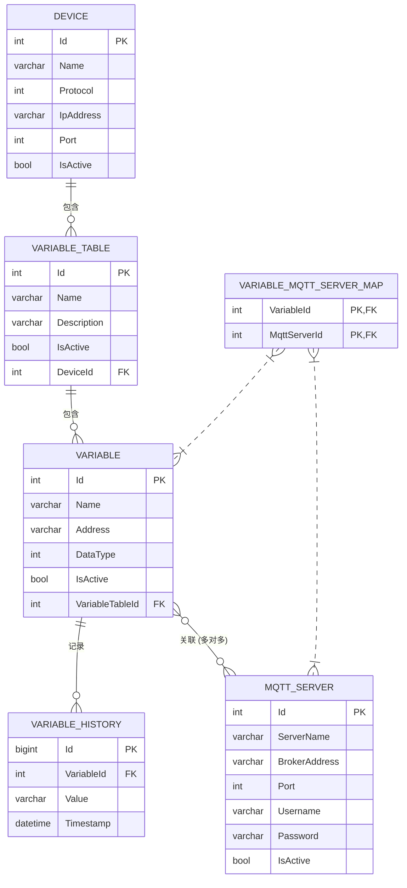

# 软件开发文档 - 02. 数据库设计

本文档详细描述了DMS系统的数据库结构，包括表、字段和关系。数据库实体类将放在 `DMS.Infrastructure/Entities/` 目录下。

## 1. 数据库关系图 (ERD)



## 2. 数据库实体类 (`Entities/`)

这些是与数据库表一一对应的C#类，使用了 `SqlSugar` 的特性（Attribute）来定义主键、外键等。

### 2.1. `DbDevice`

```csharp
// 文件: DMS.Infrastructure/Entities/DbDevice.cs
using SqlSugar;

namespace DMS.Infrastructure.Entities;

[SugarTable("Devices")]
public class DbDevice
{
    [SugarColumn(IsPrimaryKey = true, IsIdentity = true)]
    public int Id { get; set; }
    public string Name { get; set; }
    public int Protocol { get; set; } // 对应 ProtocolType 枚举
    public string IpAddress { get; set; }
    public int Port { get; set; }
    public bool IsActive { get; set; }
}
```

### 2.2. `DbVariableTable`

```csharp
// 文件: DMS.Infrastructure/Entities/DbVariableTable.cs
using SqlSugar;

namespace DMS.Infrastructure.Entities;

[SugarTable("VariableTables")]
public class DbVariableTable
{
    [SugarColumn(IsPrimaryKey = true, IsIdentity = true)]
    public int Id { get; set; }
    public string Name { get; set; }
    public string Description { get; set; }
    public bool IsActive { get; set; }
    public int DeviceId { get; set; }
}
```

### 2.3. `DbVariable`

```csharp
// 文件: DMS.Infrastructure/Entities/DbVariable.cs
using SqlSugar;

namespace DMS.Infrastructure.Entities;

[SugarTable("Variables")]
public class DbVariable
{
    [SugarColumn(IsPrimaryKey = true, IsIdentity = true)]
    public int Id { get; set; }
    public string Name { get; set; }
    public string Address { get; set; }
    public int DataType { get; set; } // 对应 SignalType 枚举
    public bool IsActive { get; set; }
    public int VariableTableId { get; set; }
}
```

### 2.4. `DbMqttServer`

```csharp
// 文件: DMS.Infrastructure/Entities/DbMqttServer.cs
using SqlSugar;

namespace DMS.Infrastructure.Entities;

[SugarTable("MqttServers")]
public class DbMqttServer
{
    [SugarColumn(IsPrimaryKey = true, IsIdentity = true)]
    public int Id { get; set; }
    public string ServerName { get; set; }
    public string BrokerAddress { get; set; }
    public int Port { get; set; }
    public string Username { get; set; }
    public string Password { get; set; }
    public bool IsActive { get; set; }
}
```

### 2.5. `DbVariableHistory`

```csharp
// 文件: DMS.Infrastructure/Entities/DbVariableHistory.cs
using SqlSugar;

namespace DMS.Infrastructure.Entities;

[SugarTable("VariableHistories")]
public class DbVariableHistory
{
    [SugarColumn(IsPrimaryKey = true, IsIdentity = true)]
    public long Id { get; set; }
    public int VariableId { get; set; }
    public string Value { get; set; }
    public DateTime Timestamp { get; set; }
}
```

### 2.6. `DbVariableMqttMap` - 多对多关系映射表

用于连接 `Variable` 和 `MqttServer`。

```csharp
// 文件: DMS.Infrastructure/Entities/DbVariableMqttMap.cs
using SqlSugar;

namespace DMS.Infrastructure.Entities;

[SugarTable("VariableMqttMap")]
public class DbVariableMqttMap
{
    [SugarColumn(IsPrimaryKey = true)]
    public int VariableId { get; set; }

    [SugarColumn(IsPrimaryKey = true)]
    public int MqttServerId { get; set; }
}
```

## 3. 数据映射 (Mapping)

为了在领域模型 (`DMS.Core.Models`) 和数据库实体 (`DMS.Infrastructure.Entities`) 之间进行转换，我们将使用 `AutoMapper`。映射配置将放在 `DMS.Infrastructure/Profiles/MappingProfile.cs` 中。

```csharp
// 文件: DMS.Infrastructure/Profiles/MappingProfile.cs
using AutoMapper;
using DMS.Core.Models;
using DMS.Infrastructure.Entities;

public class MappingProfile : Profile
{
    public MappingProfile()
    {
        CreateMap<Device, DbDevice>().ReverseMap();
        CreateMap<VariableTable, DbVariableTable>().ReverseMap();
        CreateMap<Variable, DbVariable>().ReverseMap();
        CreateMap<MqttServer, DbMqttServer>().ReverseMap();
        // 注意：对于复杂的嵌套映射，可能需要更详细的配置。
    }
}
```
